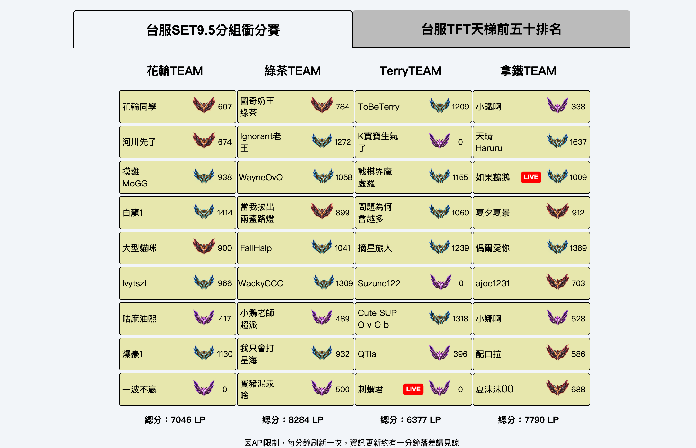
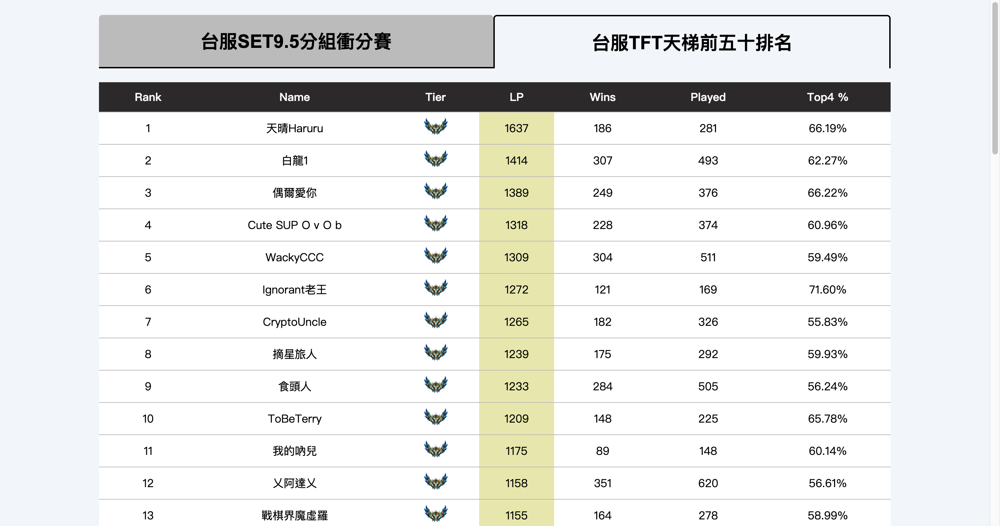
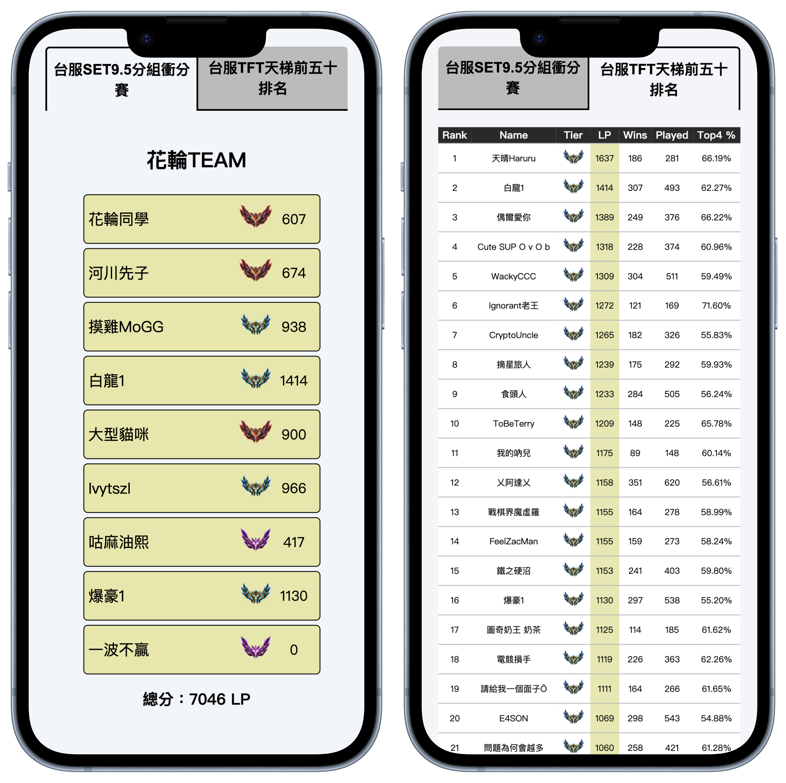
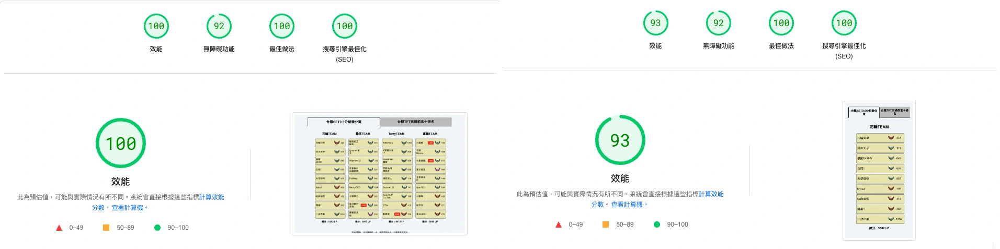

<div align="center">

# 🔥 TFTRank TW 🔥

</div>

### 🌐 Link: [https://tftrank.vercel.app/](https://tftrank-git-main-sisyphusla.vercel.app/)

### 🧩 使用工具

[](https://skillicons.dev)

## ✨ 簡介

- 為台灣電競 TFT 業餘比賽所架設的網站
- 使用 VITE 快速開啟專案，網站使用 React 撰寫，Vercel 部署
- 使用 RIOT、TWITCH API 取得資料，資料實時更新，滿足觀眾需求
- 在 Vercel serverless 部署 API，以供網站使用
- 快取設計，避免用戶多次請求造成的不必要 API 資源浪費，提高用戶體驗
- RWD 設計四個版型，以符合現代觀看比賽用戶裝置多樣性的需求
- 設計 SEO

### 👀 Preview









### 💻 本地運作

1.申請[Riot 開發者 API](https://developer.riotgames.com/apis)以及[Twitch 開發者 API](https://dev.twitch.tv/docs/api/)權限

2.Clone 到本地端

```bash
$ git clone https://github.com/sisyphusla/TFTRank.git
```

3.安裝依賴套件

```bash
$ npm i
```

4.在根目錄創建`.env`並新增您的 APIKey

```
VITE_API_KEY="Your Roit API key"
VITE_TWITCH_CLIENT_ID = "Your Twitch client ID"
VITE_TWITCH_OAUTH_TOKEN = "Your Twitch OAuth token"
```

5.啟動本地端測試

```bash
$ vercel dev
```
